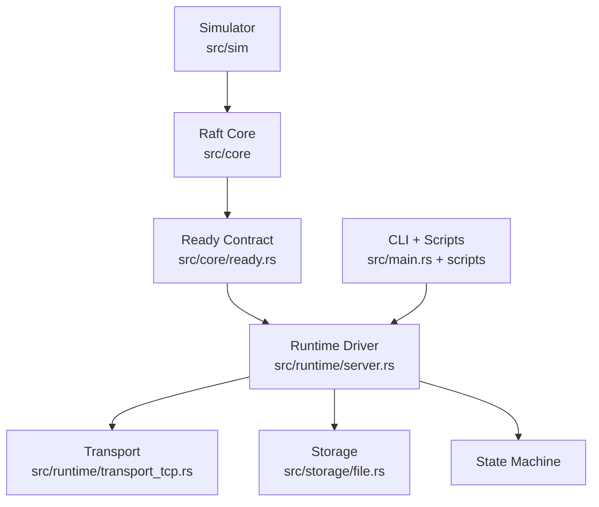
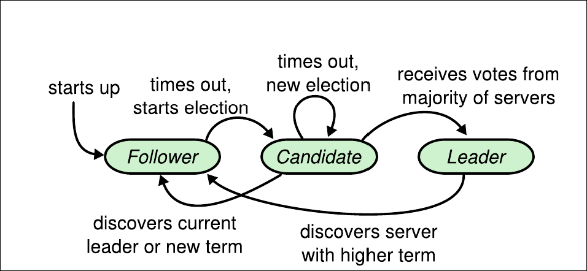
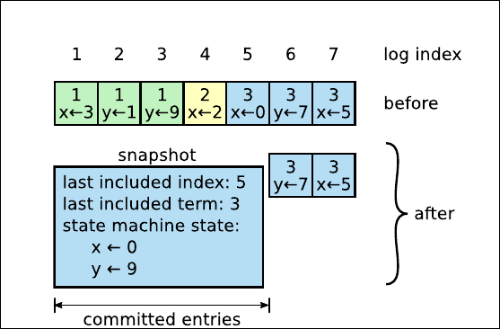
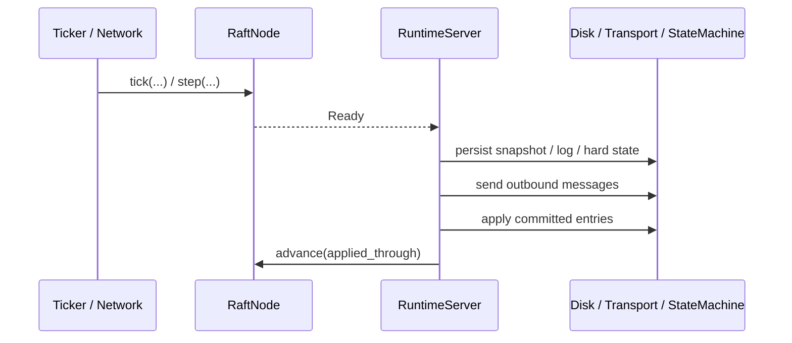
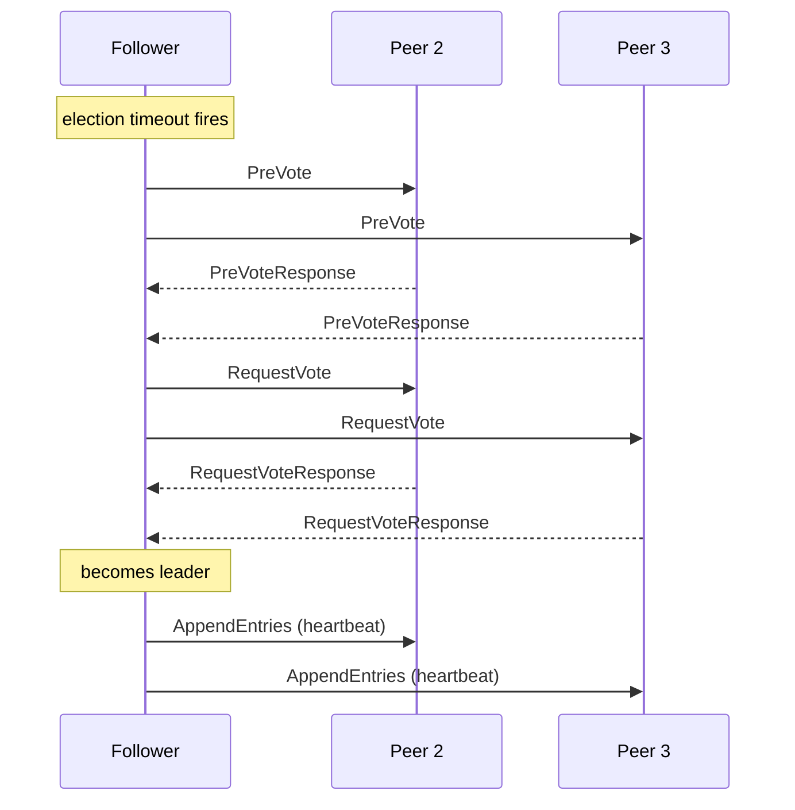
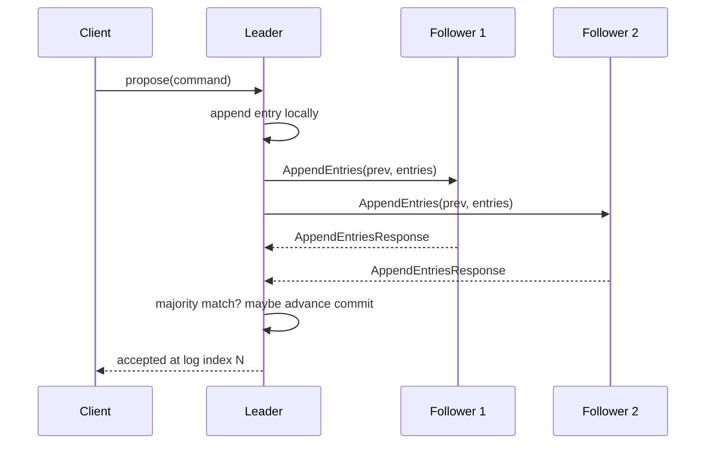
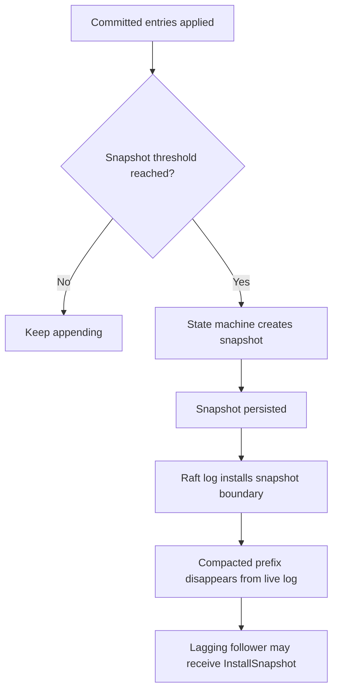

# raft

A complete Raft implementation in Rust. Pure core, deterministic simulator, real multi-process runtime over raw TCP. No async framework, no RPC framework, no consensus crate, no hidden magic. Just the algorithm, the storage, the network, and the failure modes.

This repository implements the parts of Raft that actually matter when you want to watch a cluster behave like a cluster:

- leader election,
- PreVote,
- heartbeat-based leadership,
- quorum-loss stepdown,
- replicated log append,
- conflict repair and fast backtracking,
- commit advancement with the current-term rule,
- snapshot install,
- local snapshot creation and log compaction,
- crash and restart recovery,
- a deterministic simulator with partitions, crashes, delays, drops, duplication, and invariant checking,
- a real runtime you can launch as separate server processes and kill on purpose.

The reference paper for the implementation is:

- [In Search of an Understandable Consensus Algorithm (Extended Version)](https://raft.github.io/raft.pdf)

If you want the design rationale specific to this repository, start with [Architecture.md](Architecture.md).

---

## Why Raft

Raft solves the replicated state machine problem by making one server the leader, forcing log entries to flow from that leader to followers, and using majority agreement to decide when those entries are durable enough to commit.

The original paper is famous for one reason more than any other: it decomposes consensus into pieces that humans can reason about.

- leader election,
- log replication,
- safety,
- membership changes.

This repository follows that spirit very closely. The implementation is split so that:

- the **Raft core** is a pure state machine,
- **time** enters from outside via `tick(...)`,
- **messages** enter from outside via `step(...)`,
- **side effects** leave the core through `Ready`,
- **storage**, **transport**, **runtime**, and **simulation** all sit outside the algorithm.

That split is the difference between “a distributed system that happens to compile” and “a consensus engine you can actually debug.”

---

## What This Repository Implements

| Area | Status | Notes |
|---|---|---|
| Leader election | Implemented | Randomized timeouts, PreVote, vote freshness checks |
| Strong leader replication | Implemented | Entries only originate at the leader |
| Heartbeats | Implemented | Empty `AppendEntries` maintain leadership |
| Quorum-loss stepdown | Implemented | Leader steps down when it stops hearing from a majority |
| Log repair | Implemented | Follower conflict reporting + leader fast backtracking |
| Commit advancement | Implemented | Uses majority match index + current-term rule |
| Snapshot install | Implemented | `InstallSnapshot` RPC and follower staging |
| Local snapshot creation | Implemented | Runtime policy creates snapshots from applied state |
| Log compaction | Implemented | Both memory and file-backed stores compact correctly |
| Crash recovery | Implemented | Snapshot restore + replay of committed suffix |
| Deterministic simulation | Implemented | Drops, delays, partitions, duplication, crash/restart |
| Real TCP runtime | Implemented | Separate processes, file-backed state, admin plane |


The shipped runtime uses a replicated **counter** as the demo application in [`src/main.rs`](src/main.rs). The simulator tests use a replicated **in-memory key-value machine** in [`src/sm/mem_kv.rs`](src/sm/mem_kv.rs).

---

## Architecture




The project has four layers.

### 1. Raft core

The core owns:

- terms,
- votes,
- roles,
- election timers,
- replication progress,
- commit advancement,
- snapshot staging,
- the `Ready` output bundle.

The core does **not** own:

- sockets,
- threads,
- wall clocks,
- disk formats,
- application logic.

That is exactly what you want from a consensus engine.

### 2. Replaceable boundaries

The core is parameterized over six seams:

- [`LogStore`](src/traits/log_store.rs)
- [`StableStore`](src/traits/stable_store.rs)
- [`SnapshotStore`](src/traits/snapshot_store.rs)
- [`StateMachine`](src/traits/state_machine.rs)
- [`Transport`](src/traits/transport.rs)
- [`Ticker`](src/traits/ticker.rs)

Those are real replacement points, not decorative abstractions.

### 3. Deterministic simulator

The simulator drives multiple nodes in-process with:

- fake time,
- fake network,
- crash and restart,
- partitions,
- drops,
- duplication,
- invariant checks after every transition.

The simulator is where most correctness bugs should die.

### 4. Real runtime

The runtime is deliberately boring. It:

1. receives inbound messages,
2. ticks the node,
3. drains `Ready`,
4. persists snapshots and log state,
5. sends outbound messages,
6. applies committed entries,
7. advances the node,
8. creates local snapshots when policy says to.

The runtime being boring is a feature, not a limitation.

---

## Repository Layout

```text
src/
  lib.rs
  entry.rs
  message.rs
  types.rs

  core/
    mod.rs
    node.rs
    state.rs
    election.rs
    replication.rs
    commit.rs
    ready.rs

  traits/
    log_store.rs
    stable_store.rs
    snapshot_store.rs
    state_machine.rs
    transport.rs
    ticker.rs

  storage/
    codec.rs
    mem.rs
    file.rs

  sm/
    mem_kv.rs

  sim/
    cluster.rs
    scheduler.rs
    network.rs
    recorder.rs
    invariants.rs

  runtime/
    mod.rs
    server.rs
    transport_tcp.rs
    ticker_wall.rs
    client.rs

  main.rs

scripts/
  run_cluster.sh
  watch.sh
  status.sh
  propose.sh
  snapshot.sh
  kill_leader.sh
  restart_node.sh
  shutdown_node.sh
  stop_cluster.sh
  common.sh

tests/
  election.rs
  heartbeat.rs
  replication.rs
  fast_backtrack.rs
  commit.rs
  persistence.rs
  snapshot.rs
  partition.rs
  chaos.rs
  sim_smoke.rs
```

If you only want the algorithm, read `src/core`.

If you want the failure model, read `src/sim`.

If you want the live cluster, read `src/runtime` and `src/main.rs`.

---

## Core State Model

Raft is mostly about a few pieces of state and how carefully they are updated.



The basic types live in [`src/types.rs`](src/types.rs):

```rust
pub type NodeId = u64;
pub type Term = u64;
pub type LogIndex = u64;

#[derive(Debug, Clone, Copy, PartialEq, Eq)]
pub enum Role {
    Leader,
    Follower,
    Candidate,
}
```

### Durable state

The durable state is `HardState`:

```rust
#[derive(Debug, Clone, PartialEq, Eq)]
pub struct HardState {
    pub current_term: Term,
    pub voted_for: Option<NodeId>,
    pub commit: LogIndex,
}
```

This survives crashes. If the process dies and comes back, this is the state that must still be true.

### Volatile observation state

The runtime-observed state is `SoftState`:

```rust
#[derive(Debug, Clone, PartialEq, Eq)]
pub struct SoftState {
    pub role: Role,
    pub leader_id: Option<NodeId>,
}
```

This is useful for:

- status reporting,
- simulator inspection,
- runtime CLI output.

It is not the safety boundary.

### Log entries

The replicated log entry type is as small as it should be:

```rust
#[derive(Debug, Clone, PartialEq, Eq)]
pub struct LogEntry<C> {
    pub index: LogIndex,
    pub term: Term,
    pub command: C,
}
```

The command is generic. The algorithm does not care whether the entry is:

- a key-value write,
- a counter increment,
- or something else.

That separation is exactly right.

### Snapshots



Snapshots are represented as:

```rust
#[derive(Debug, Clone, PartialEq, Eq)]
pub struct Snapshot<S> {
    pub last_included_index: LogIndex,
    pub last_included_term: Term,
    pub data: S,
}
```

This is the minimum information Raft needs for compaction:

- where the compacted prefix ends,
- what term that boundary belongs to,
- what state machine image represents that prefix.

---

## The RPC Model

The Raft wire messages live in [`src/message.rs`](src/message.rs).

The implementation supports the full message set used by this repository:

- `PreVote`
- `PreVoteResponse`
- `RequestVote`
- `RequestVoteResponse`
- `AppendEntries`
- `AppendEntriesResponse`
- `InstallSnapshot`
- `InstallSnapshotResponse`

Everything is wrapped in:

```rust
pub struct Envelope<C, S> {
    pub from: NodeId,
    pub to: NodeId,
    pub msg: Message<C, S>,
}
```

That one wrapper is what makes the simulator and runtime share the same protocol surface.

---

## The `RaftNode` Core

The main algorithmic type is [`RaftNode`](src/core/node.rs).

It exposes exactly the kind of public surface a pure Raft core should expose:

- `tick(...)`
- `step(...)`
- `propose(...)`
- `ready()`
- `advance(...)`
- `restore_snapshot(...)`

That is the whole mental model:

- external time enters through `tick`,
- external messages enter through `step`,
- client commands enter through `propose`,
- side effects come out through `ready`,
- the runtime tells the node how far the application has advanced through `advance`.

This is one of the strongest parts of the design because it keeps the algorithm decoupled from the environment.

---

## The `Ready` Contract

The most important runtime boundary in the project is [`Ready`](src/core/ready.rs):

```rust
#[derive(Debug, Clone, Default)]
pub struct Ready<C, S> {
    pub hard_state: Option<HardState>,
    pub entries_to_persist: Vec<LogEntry<C>>,
    pub snapshot: Option<Snapshot<S>>,
    pub messages: Vec<Envelope<C, S>>,
    pub committed_entries: Vec<LogEntry<C>>,
    pub soft_state_changed: bool,
}
```

This is the contract between the pure algorithm and the outer world.

It says:

- here is durable metadata that changed,
- here are log entries that were appended,
- here is a staged snapshot if one exists,
- here are outbound messages to send,
- here are committed entries ready for application,
- here is a soft-state change that observers may care about.

### Why this matters

Without a `Ready` abstraction, Raft implementations tend to smear together:

- persistence,
- networking,
- state machine application,
- algorithmic state transitions.

That is where subtle bugs usually begin.

### Runtime flow




That sequence is the heart of the runtime.

---

## Leader Election

Raft works because one leader wins and the rest of the cluster agrees to follow it.

The election logic is in [`src/core/election.rs`](src/core/election.rs).

### PreVote first

This repository implements PreVote before the real election:

```rust
fn start_prevote(&mut self) {
    self.set_role(Role::Candidate);
    self.set_leader_id(None);
    self.rearm_election_timer();
    self.prevote_phase = true;
    self.leader_recent_active.clear();
    self.votes_received.clear();
    self.votes_received.insert(self.id);

    let request = PreVoteRequest {
        term: self.current_term() + 1,
        candidate_id: self.id,
        last_log_index: self.last_log_index(),
        last_log_term: self.last_log_term(),
    };
    ...
}
```

This is a production-hardening feature. It lets a node ask, “could I win?” before it actually increments the real term.

That helps reduce disruption from:

- isolated nodes,
- delayed networks,
- unstable followers.

### The real election

If PreVote succeeds, the node starts the actual vote:

```rust
fn start_election(&mut self) {
    let next_term = self.current_term() + 1;

    self.prevote_phase = false;
    self.leader_recent_active.clear();
    self.set_current_term(next_term);
    self.set_role(Role::Candidate);
    self.set_leader_id(None);
    self.rearm_election_timer();
    self.votes_received.clear();

    self.set_voted_for(Some(self.id));
    self.votes_received.insert(self.id);
    ...
}
```

That is classic Raft:

- increment term,
- vote for self,
- ask for votes,
- become leader on majority.

### Vote freshness

The paper’s “up-to-date log” rule is implemented directly:

```rust
fn is_log_up_to_date(&self, candidate_last_index: u64, candidate_last_term: u64) -> bool {
    let local_last_term = self.last_log_term();
    let local_last_index = self.last_log_index();

    if candidate_last_term != local_last_term {
        candidate_last_term > local_last_term
    } else {
        candidate_last_index >= local_last_index
    }
}
```

This is one of the most important safety checks in the entire system. It is what prevents a stale node from winning leadership over a more complete node.

### Becoming leader

On majority:

```rust
fn become_leader(&mut self) {
    let next_index = self.last_log_index() + 1;
    let mut progress = HashMap::with_capacity(self.peers.len());
    ...
    self.set_role(Role::Leader);
    self.set_leader_id(Some(self.id));
    self.leader_state = Some(LeaderState { progress });
    ...
    self.broadcast_heartbeats();
}
```

The leader immediately initializes follower progress and starts asserting authority.

### Election sequence




### Heartbeats and quorum-loss stepdown

The leader path also tracks follower activity. If a leader stops hearing from a majority for long enough, it steps down:

```rust
fn maybe_step_down_on_quorum_loss(&mut self) -> bool {
    if self.soft_state.role != Role::Leader {
        return false;
    }

    if self.election_elapsed < self.election_timeout {
        return false;
    }

    let has_quorum = self.has_check_quorum();
    self.leader_recent_active.clear();
    self.reset_election_timer();

    if has_quorum {
        return false;
    }

    self.prevote_phase = false;
    self.become_follower(self.current_term(), None);
    true
}
```

This is why the runtime demo behaves correctly when you kill the leader. The old leader does not keep pretending forever.

### Tests

The election path is covered by:

- [`tests/election.rs`](tests/election.rs)
- [`tests/heartbeat.rs`](tests/heartbeat.rs)

Those tests cover:

- successful election,
- stale vote rejection,
- split vote resolution,
- leader stability under heartbeats,
- stale leader displacement,
- stepdown on quorum loss.

---

## Log Replication

Raft’s strongest simplification is that log entries only flow from the leader to followers.

This repository follows that strictly.

### Proposing a command

The leader append path in [`src/core/node.rs`](src/core/node.rs) is intentionally small:

```rust
pub fn propose(&mut self, cmd: C) -> Result<LogIndex, ProposeError> {
    if self.soft_state.role != Role::Leader {
        return Err(ProposeError::NotLeader);
    }

    let entry = LogEntry {
        index: self.last_log_index() + 1,
        term: self.current_term(),
        command: cmd,
    };

    self.log.append(std::slice::from_ref(&entry));
    self.pending_entries.push(entry.clone());
    self.broadcast_append_entries();

    Ok(entry.index)
}
```

This is the strong-leader model in one function:

- only the leader can accept a command,
- the leader appends locally first,
- replication begins immediately.

### Sending `AppendEntries`

Replication uses per-follower progress:

```rust
let request = AppendEntriesRequest {
    term: self.current_term(),
    leader_id: self.id,
    prev_log_index,
    prev_log_term,
    entries: self.log.entries(next_index, usize::MAX),
    leader_commit: self.commit_index,
};
```

The key fields are:

- `prev_log_index`
- `prev_log_term`
- `entries`
- `leader_commit`

Everything Raft needs for log matching is contained there.

### Follower-side consistency check

On the follower:

```rust
fn check_prev_log_match(
    &self,
    prev_log_index: LogIndex,
    prev_log_term: Term,
) -> Result<(), (Option<Term>, LogIndex)> {
    if prev_log_index == 0 {
        return Ok(());
    }

    let Some(local_term) = self.log.term(prev_log_index) else {
        return Err((None, self.last_log_index() + 1));
    };

    if local_term == prev_log_term {
        return Ok(());
    }

    let first_index = self.first_index_of_term(local_term, prev_log_index);
    Err((Some(local_term), first_index))
}
```

This is one of the cleaner parts of the implementation. Followers do not just reject. They explain enough for the leader to repair quickly.

### Appending the leader’s suffix

Once the prefix matches:

```rust
fn append_from_leader(&mut self, entries: &[LogEntry<C>]) {
    if entries.is_empty() {
        return;
    }

    let mut first_new_offset = None;

    for (offset, incoming) in entries.iter().enumerate() {
        match self.log.term(incoming.index) {
            Some(local_term) if local_term == incoming.term => {}
            Some(_) => {
                self.log.truncate_suffix(incoming.index);
                first_new_offset = Some(offset);
                break;
            }
            None => {
                first_new_offset = Some(offset);
                break;
            }
        }
    }

    if let Some(offset) = first_new_offset {
        let suffix = &entries[offset..];
        self.log.append(suffix);
        self.pending_entries.extend(suffix.iter().cloned());
    }
}
```

This is Raft’s overwrite rule in concrete form:

- keep matching prefix,
- truncate conflicting suffix,
- append the leader’s version of history.

### Replication flow




### Fast backtracking

This implementation includes the conflict-term optimization that many minimal Raft projects skip.

Leader-side repair logic:

```rust
fn backtrack_next_index(&self, response: &AppendEntriesResponse) -> Option<LogIndex> {
    if let Some(conflict_term) = response.conflict_term {
        if let Some(last_index) = self.last_index_of_term(conflict_term) {
            return Some(last_index + 1);
        }
    }

    response.conflict_index
}
```

That means the leader can jump:

- to the end of the conflicting term if it has that term,
- otherwise directly to the follower’s reported conflict index.

This is much better than walking one index at a time.

### Tests

Replication behavior is covered by:

- [`tests/replication.rs`](tests/replication.rs)
- [`tests/fast_backtrack.rs`](tests/fast_backtrack.rs)

Those files verify:

- majority replication,
- follower catch-up,
- conflicting suffix repair,
- conflict-term reporting,
- fast leader backtracking.

---

## Commit and Safety

Replication is not enough. Raft needs a principled rule for when replicated entries become committed.

The commit logic is in [`src/core/commit.rs`](src/core/commit.rs).

### Majority match index

The leader computes a candidate commit point from all match indexes:

```rust
let mut matched = Vec::with_capacity(leader_state.progress.len() + 1);
matched.push(self.last_log_index());
matched.extend(
    leader_state
        .progress
        .values()
        .map(|progress| progress.match_index),
);
matched.sort_unstable();

let candidate_commit = matched[matched.len() / 2];
```

That is the majority boundary.

### Current-term restriction

Then comes the subtle but essential rule:

```rust
let Some(candidate_term) = self.log.term(candidate_commit) else {
    return;
};

if candidate_term != self.current_term() {
    return;
}
```

This is exactly what the Raft paper requires:

- a leader only directly advances commit index based on entries from its **current term**.

Older entries become committed indirectly once a current-term entry commits past them.

### Committing entries

Once safe:

```rust
pub(crate) fn commit_to(&mut self, new_commit: LogIndex) {
    let new_commit = new_commit.min(self.last_log_index());

    if new_commit <= self.commit_index {
        return;
    }

    let start = self.commit_index + 1;
    let count = (new_commit - start + 1) as usize;
    let newly_committed: Vec<LogEntry<C>> = self.log.entries(start, count);

    self.commit_index = new_commit;

    let mut hs = self.stable.hard_state();
    hs.commit = new_commit;
    self.set_hard_state(hs);

    self.committed.extend(newly_committed);
}
```

That does three things:

- advances the in-memory commit point,
- persists the durable commit point,
- stages newly committed entries for application via `Ready`.

### Safety checks in the simulator

The simulator invariant checker in [`src/sim/invariants.rs`](src/sim/invariants.rs) encodes a number of paper-level safety properties directly:

- no multiple leaders in the same term,
- leader append-only,
- log matching,
- commit never past log end,
- applied never past commit,
- term / commit / apply monotonicity,
- snapshot boundary sanity.

This is one of the most serious parts of the repository because it does not trust hand-wavy reasoning. It executes the safety checks after transitions.

### Tests

Commit behavior is verified in [`tests/commit.rs`](tests/commit.rs), including:

- minority does not commit,
- majority does commit,
- old-term entries are not directly committed by a new leader.

---

## Storage Model

The storage layer is simple on purpose.

### Trait seams

The storage-relevant traits are:

- [`LogStore`](src/traits/log_store.rs)
- [`StableStore`](src/traits/stable_store.rs)
- [`SnapshotStore`](src/traits/snapshot_store.rs)

### In-memory storage

[`src/storage/mem.rs`](src/storage/mem.rs) provides `MemStorage<C, S>`, which implements:

- `StableStore`,
- `SnapshotStore<S>`,
- `LogStore<C>`.

This makes tests and simulation easy.

### File-backed storage

[`src/storage/file.rs`](src/storage/file.rs) provides:

- `FileStableStore`
- `FileLogStore<C, Codec>`
- `FileSnapshotStore<S, Codec>`

That is what the real runtime uses.

### Durable `HardState`

The file-backed stable store persists state like:

```text
current_term=3
voted_for=1
commit=7
```

That is transparent, easy to inspect, and good enough for a real demo runtime.

### Log file format

The file-backed log persists:

```text
snapshot_index=5
snapshot_term=2
entry=6,3,0100000000000000
entry=7,3,0a00000000000000
```

The command payload is hex-encoded through a codec from [`src/storage/codec.rs`](src/storage/codec.rs).

### Why the core does not know about files

This is the right separation. Raft should care about:

- log indexes,
- terms,
- truncation,
- compaction,
- snapshots.

It should not care about:

- file names,
- temp files,
- atomic renames,
- fsync strategy,
- disk layouts.

That is why the storage traits are a real success in this design.

---

## Snapshots and Log Compaction

Snapshots are implemented end to end here, not just as a single RPC.

That means the repository supports:

- snapshot-aware log stores,
- a snapshot store,
- snapshot install messages,
- follower-side staging,
- runtime-side snapshot persistence,
- local snapshot creation,
- compaction through the created snapshot,
- restart recovery from snapshot plus committed suffix.

### Follower-side snapshot staging

When a follower receives `InstallSnapshot`, it stages it:

```rust
pub(crate) fn stage_snapshot(&mut self, snapshot: Snapshot<S>) {
    let snapshot_index = snapshot.last_included_index;
    let snapshot_term = snapshot.last_included_term;

    if self.should_ignore_staged_snapshot(snapshot_index, snapshot_term) {
        return;
    }

    self.log.install_snapshot(snapshot_index, snapshot_term);
    self.commit_to_snapshot(snapshot_index);
    self.pending_entries.clear();
    self.committed.retain(|entry| entry.index > snapshot_index);
    self.pending_snapshot = Some(snapshot);
}
```

The core does not immediately apply the snapshot to the state machine. It stages it for the runtime through `Ready`. That is the right boundary.

### Promoting a snapshot

Once the runtime accepts it:

```rust
pub fn restore_snapshot(&mut self, snapshot: Snapshot<S>) {
    ...
    self.log.install_snapshot(snapshot_index, snapshot_term);
    self.commit_to_snapshot(snapshot_index);
    self.committed.retain(|entry| entry.index > snapshot_index);
    self.pending_snapshot = None;
    self.latest_snapshot = Some(snapshot);
}
```

### Local snapshot policy

The runtime supports local snapshot creation with:

```rust
pub enum SnapshotPolicy {
    Never,
    EveryAppliedEntries(u64),
}
```

And the creation path:

```rust
fn create_local_snapshot_through(&mut self, snapshot_index: LogIndex) -> RuntimeResult<()> {
    let snapshot_term = self.snapshot_term(snapshot_index).ok_or_else(|| { ... })?;

    let snapshot = Snapshot {
        last_included_index: snapshot_index,
        last_included_term: snapshot_term,
        data: self.state_machine.snapshot(),
    };

    self.snapshot_store.save(snapshot.clone());
    self.raft.restore_snapshot(snapshot);
    Ok(())
}
```

This is what makes log compaction actually happen in the real runtime instead of existing only as a theoretical capability.

### Snapshot lifecycle



### Tests

Snapshot and compaction behavior is covered by [`tests/snapshot.rs`](tests/snapshot.rs).

That suite checks:

- compaction semantics,
- file snapshot persistence,
- snapshot staging,
- snapshot promotion,
- lagging follower recovery using InstallSnapshot.

---

## Crash Recovery

Crash recovery is one of the places where the runtime proves it is real.

### Core durability

When a node restarts:

- `current_term` survives,
- `voted_for` survives,
- `commit` survives,
- log entries survive,
- snapshots survive.

### Runtime recovery

The runtime completes the recovery story by reconstructing the state machine from disk in [`src/runtime/server.rs`](src/runtime/server.rs):

```rust
fn recover_state_machine_from_storage(&mut self) -> RuntimeResult<()> {
    if let Some(snapshot) = self.snapshot_store.latest().cloned() {
        self.raft.restore_snapshot(snapshot.clone());
        self.state_machine.restore(snapshot.data);
        self.stats.snapshots_restored += 1;
    }

    let already_applied = self.state_machine.last_applied();
    let commit_index = self.raft.commit_index();
    ...
    let entries = self.raft.log.entries(from, count);
    ...
    for entry in entries {
        self.state_machine.apply(entry.index, &entry.command);
        applied_through = entry.index;
    }
    ...
}
```

This is exactly what a correct restart path needs to do:

- restore from latest snapshot,
- replay committed suffix,
- advance the node’s applied state.

Without this step, the metadata might be correct while the application state is stale.

### Tests

Crash and restart behavior is validated in [`tests/persistence.rs`](tests/persistence.rs).

That file covers:

- crash after commit,
- crash before commit,
- full restart and lagging follower catch-up.

---

## Deterministic Simulator

The simulator is not a toy. It is one of the best parts of the repository.

It lives in [`src/sim`](src/sim) and provides:

- a simulated cluster,
- a simulated network,
- a seeded RNG,
- a scheduled delivery queue,
- an event recorder,
- an invariant checker.

### Simulated network

[`src/sim/network.rs`](src/sim/network.rs) models:

- node isolation,
- network partitions,
- down nodes,
- random drop rates,
- delivery delay ranges.

The failure
```mermaid
 reasons are explicit:

```rust
pub enum DropReason {
    Filtered,
    RandomDrop,
    IsolatedNode(NodeId),
    DownNode(NodeId),
    Partitioned { from: NodeId, to: NodeId },
}
```

That matters because good simulation is not just “some messages vanished.” It should tell you why.

### Scheduler

[`src/sim/scheduler.rs`](src/sim/scheduler.rs) gives you a real action language:

```rust
pub enum SimAction<C, S> {
    AdvanceTime { ticks: u64 },
    TickNode { node_id: NodeId, ticks: u64 },
    DeliverNext,
    DeliverAll { max_steps: usize },
    Propose { node_id: NodeId, command: C },
    Inject { message: Envelope<C, S> },
    Crash { node_id: NodeId },
    Restart { node_id: NodeId },
    Isolate { node_id: NodeId },
    Heal { node_id: NodeId },
    Partition { groups: Vec<Vec<NodeId>> },
    ...
}
```

That means tests can express distributed scenarios at the right level instead of faking them indirectly.

### Recorder

[`src/sim/recorder.rs`](src/sim/recorder.rs) records:

- message scheduling,
- message delivery,
- message drops,
- duplication,
- proposals,
- crashes,
- restarts,
- partitions,
- role changes,
- term changes,
- commit advancement.

That gives you a narrative of the cluster, not just a final pass/fail.

### Invariants

[`src/sim/invariants.rs`](src/sim/invariants.rs) checks safety properties after transitions.

Notable violations it can detect:

- multiple leaders in the same term,
- leader append-only violations,
- log matching violations,
- commit past log end,
- applied past commit,
- commit regression,
- apply regression,
- snapshot boundary inconsistency.

That is exactly the kind of simulator a Raft implementation should have.

### Deterministic seeded behavior

`tests/sim_smoke.rs` verifies that the same seed and same action sequence produce the same trace and outcome. That is incredibly useful when debugging distributed behavior.

---

## Real Runtime

The real runtime is under [`src/runtime`](src/runtime).

### Runtime server

[`src/runtime/server.rs`](src/runtime/server.rs) is the main driver loop.

Its job is simple:

1. drain inbound messages,
2. ask the ticker how many logical ticks elapsed,
3. call `tick(...)`,
4. drain `Ready`,
5. persist snapshots and state updates,
6. send outbound messages,
7. apply committed entries,
8. maybe create a new local snapshot.

This is exactly the correct shape. The runtime should be glue, not algorithm.

### Wall-clock ticker

[`src/runtime/ticker_wall.rs`](src/runtime/ticker_wall.rs) converts elapsed wall time to logical ticks. The important detail is that it preserves sub-tick remainder instead of losing drift by resetting to `Instant::now()` every time.

### TCP transport

[`src/runtime/transport_tcp.rs`](src/runtime/transport_tcp.rs) implements:

- framed TCP transport,
- generic encoding for commands and snapshots,
- all Raft RPC variants,
- inbound listener thread,
- outbound batching by destination.

The frame format is:

```text
[payload_len: 8B big-endian][payload]
```

And the payload contains:

- `from`,
- `to`,
- message tag,
- message-specific fields.

The codec stays generic by delegating command and snapshot serialization to:

- `CommandCodec<C>`
- `SnapshotCodec<S>`

### Runtime stats

The runtime exposes basic counters through `RuntimeStats` in [`src/runtime/mod.rs`](src/runtime/mod.rs):

- ticks observed,
- inbound messages processed,
- outbound messages sent,
- committed entries applied,
- snapshots restored.

This is not a full tracing stack, but it makes the live runtime far easier to inspect.

---

## The Multi-Process Runtime Binary

The real per-node process is implemented in [`src/main.rs`](src/main.rs).

This is not a single-process toy cluster. Each `node` process owns:

- a Raft TCP listener,
- an admin TCP listener,
- file-backed `HardState`,
- file-backed log,
- file-backed snapshot store,
- a wall ticker,
- a local state machine,
- a `RuntimeServer`.

### CLI surface

The binary supports:

- `node`
- `status`
- `watch`
- `propose`
- `snapshot`
- `shutdown`

### Cluster member format

Each node receives the full cluster map via repeated `--cluster` entries:

```text
<node_id>=<raft_addr>@<admin_addr>
```

For example:

```text
1=127.0.0.1:7001@127.0.0.1:8001
```

### Demo application

The runtime uses a replicated **counter** state machine:

- command type: `u64`
- state: `total`
- operation: `apply(index, delta)` adds `delta`

That means:

```bash
./scripts/propose.sh 5
./scripts/propose.sh 7
```

should move the replicated value from `0` to `5` to `12`.

### Admin plane

The admin port accepts simple line-based commands:

- `status`
- `propose <value>`
- `snapshot`
- `shutdown`

That keeps the Raft transport separate from operator control traffic, which is the right design.

---

## Scripts

The shell scripts in [`scripts/`](scripts/) are the easiest way to run the cluster.

### `run_cluster.sh`

Starts all nodes in the background, writes logs to:

```text
data/runtime-cluster/logs/
```

and PID files to:

```text
data/runtime-cluster/pids/
```

### `watch.sh`

Continuously prints cluster state:

- role,
- leader,
- term,
- commit,
- applied,
- log range,
- snapshot boundary,
- state value,
- runtime counters.

### `status.sh`

One-shot cluster state.

### `propose.sh`

Submits a counter increment command to the cluster.

### `kill_leader.sh`

Finds the current leader and sends `SIGKILL`. This is the fastest way to demonstrate:

- leader death,
- re-election,
- old leader restart behavior.

### `restart_node.sh`

Restarts a node with the same persistent data directory.

### `snapshot.sh`

Forces a local snapshot so you can observe compaction immediately.

### `shutdown_node.sh` / `stop_cluster.sh`

Graceful node or cluster shutdown.

---

## Running the Cluster

### Recommended workflow

Use three terminals.

### Terminal 1: start the cluster

```bash
./scripts/run_cluster.sh
```

### Terminal 2: watch it

```bash
./scripts/watch.sh
```

### Terminal 3: operate it

```bash
./scripts/propose.sh 5
./scripts/propose.sh 7
./scripts/propose.sh 11
./scripts/kill_leader.sh
./scripts/restart_node.sh 1
./scripts/snapshot.sh 1
./scripts/stop_cluster.sh
```

That is the cleanest live demo path.

### What to expect in `watch.sh`

In an idle but healthy cluster you should see:

- one `Leader`,
- the rest `Follower`,
- stable term,
- increasing message counters,
- `commit=0`,
- `applied=0`,
- `value=0`.

That is normal. Heartbeats do not create committed log entries.

After a proposal, you should see:

- `commit` advance,
- `applied` advance,
- `value` change on all healthy nodes.

After killing the leader, you should see:

- the old leader disappear,
- term increase,
- a new leader emerge,
- the restarted node come back as follower,
- eventual convergence once it catches up.

---

## Manual Per-Node Mode

If you want five fully separate terminals and direct process control, run nodes manually.

Example for node 1:

```bash
cargo run -- node --id 1 --data-dir ./data/node1 \
  --cluster 1=127.0.0.1:7001@127.0.0.1:8001 \
  --cluster 2=127.0.0.1:7002@127.0.0.1:8002 \
  --cluster 3=127.0.0.1:7003@127.0.0.1:8003 \
  --cluster 4=127.0.0.1:7004@127.0.0.1:8004 \
  --cluster 5=127.0.0.1:7005@127.0.0.1:8005
```

Start one such process per node with different `--id` and `--data-dir`, but the same full cluster map.

Then use:

```bash
cargo run -- watch \
  --cluster 1=127.0.0.1:7001@127.0.0.1:8001 \
  --cluster 2=127.0.0.1:7002@127.0.0.1:8002 \
  --cluster 3=127.0.0.1:7003@127.0.0.1:8003 \
  --cluster 4=127.0.0.1:7004@127.0.0.1:8004 \
  --cluster 5=127.0.0.1:7005@127.0.0.1:8005
```

and:

```bash
cargo run -- propose --command 5 \
  --cluster 1=127.0.0.1:7001@127.0.0.1:8001 \
  --cluster 2=127.0.0.1:7002@127.0.0.1:8002 \
  --cluster 3=127.0.0.1:7003@127.0.0.1:8003 \
  --cluster 4=127.0.0.1:7004@127.0.0.1:8004 \
  --cluster 5=127.0.0.1:7005@127.0.0.1:8005
```

This mode is useful when you want to:

- foreground node logs,
- kill processes manually,
- inspect per-node data directories as the cluster runs.

---

## What You Can Demo Right Now

This repository can already demonstrate the behaviors people usually mean when they say “real Raft.”

### 1. Elect a leader

Start a 5-node cluster and watch one node become leader.

### 2. Replicate client commands

Submit commands and watch:

- log indexes advance,
- commit advance,
- apply advance,
- replicated state machine values converge.

### 3. Kill the leader

Use:

```bash
./scripts/kill_leader.sh
```

Then watch a new leader appear.

### 4. Restart the old leader

Use:

```bash
./scripts/restart_node.sh <node-id>
```

The restarted node comes back from:

- durable `HardState`,
- durable log,
- durable snapshot,
- runtime state machine recovery.

It returns as a follower first, then may campaign later if it stops hearing from the current leader.

### 5. Force log compaction

Use:

```bash
./scripts/snapshot.sh <node-id>
```

Then watch:

- `snapshot_index` increase,
- `first_log_index` move forward,
- compacted prefixes disappear from the live log window.

### 6. Run deterministic failure scenarios

The simulator can run:

- delayed delivery,
- duplicated delivery,
- crash and restart,
- leader in majority partition,
- leader in minority partition,
- healed convergence.

That gives you both live process demos and correctness-oriented in-process testing.

---

## Test Suite

The test suite mirrors the structure of the implementation.

| Test file | Focus |
|---|---|
| [`tests/election.rs`](tests/election.rs) | PreVote, RequestVote, stale vote rejection, split votes |
| [`tests/heartbeat.rs`](tests/heartbeat.rs) | Stable leader, heartbeat behavior, quorum-loss stepdown |
| [`tests/replication.rs`](tests/replication.rs) | Majority replication, follower catch-up, suffix repair |
| [`tests/fast_backtrack.rs`](tests/fast_backtrack.rs) | Conflict-term reporting and leader skip optimization |
| [`tests/commit.rs`](tests/commit.rs) | Commit rules, current-term restriction |
| [`tests/persistence.rs`](tests/persistence.rs) | Crash recovery, durable log and hard state |
| [`tests/snapshot.rs`](tests/snapshot.rs) | Snapshot install, promotion, compaction, file snapshot store |
| [`tests/partition.rs`](tests/partition.rs) | Majority/minority partitions and healed convergence |
| [`tests/chaos.rs`](tests/chaos.rs) | Partition + crash + restart convergence |
| [`tests/sim_smoke.rs`](tests/sim_smoke.rs) | Seeded deterministic simulation smoke tests |

Run everything with:

```bash
cargo test
```

If you want simulator output visible:

```bash
cargo test --test partition -- --nocapture
cargo test --test chaos -- --nocapture
cargo test --test sim_smoke -- --nocapture
```

---

## References

- [Raft paper: In Search of an Understandable Consensus Algorithm](https://raft.github.io/raft.pdf)
- [Architecture.md](Architecture.md)

### Code map

- Core algorithm: [`src/core`](src/core)
- Types and RPCs: [`src/types.rs`](src/types.rs), [`src/message.rs`](src/message.rs), [`src/entry.rs`](src/entry.rs)
- Traits: [`src/traits`](src/traits)
- Storage: [`src/storage`](src/storage)
- Simulator: [`src/sim`](src/sim)
- Runtime: [`src/runtime`](src/runtime)
- Process binary: [`src/main.rs`](src/main.rs)
- Scripts: [`scripts`](scripts)
- Tests: [`tests`](tests)

---

## Closing

Raft is only interesting if the implementation survives contact with failure.

This repository does:

- it elects a leader,
- it replicates commands,
- it repairs divergent logs,
- it commits correctly,
- it compacts state,
- it restarts from disk,
- it steps down when leadership is no longer justified,
- it survives partitions and crash/restart scenarios in simulation,
- and it can be run as real separate server processes over TCP.

That is the difference between a Raft sketch and a Raft system.
